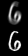
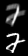

# Image Deblurring using Convolutional Neural Networks

## Contributors
* Thomas Edlich (te95)
* Omar Kadhim (Apollonius14)

## Project Goal
This project was originally carried out to participate in a License Plate Deblurring competition sponsored by Huawei. The original goal was to deblur images of license plates taken by a traffic camera. These images are often distorted, mainly due to motion blur from the car's movement but also due to random noise and lossy compression of images.

The idea of our project was to train a Convolutional Neural Network (CNN) to invert these blurring effects. The input of the CNN is hereby the blurry image and the output is the corrected image. 

Unfortunately, we are not allowed to publish any of the license plate images we were provided by Huawei for the competition. We therefore are unable to present our achieved results.

Instead, we demonstrate in this repository how CNNs can be used to deblur images from the Noisy MNIST (Motion Blur) Dataset [1].

## Approach

Using machine learning, or more specifically CNNs, for image deblurring can be quite tricky because CNNs are a supervised learning algorithm and therefore require pairs of inputs and correct labels for training. However, in deblurring scenarios we are only given blurry images (aka inputs) but no targets. The solution to this problem is to find clear pictures which depict the same things as the blurry images from the dataset and then blur these clear images artificially in order to receive targets. This however introduces the problem that the training and validation data are not generated by the same distribution as the test set (the actual blurred images). We therefore have to model the natural blur as close as possible to achieve reasonable results. 

To deblur MNIST images with motion blur, we used the clear [MNIST](http://yann.lecun.com/exdb/mnist/) dataset and blurred it artifically with motion blurs of length 4-6px and a random angle. 

Our CNN had a fairly simple architecture of 3 convolutional layers with kernel sizes of 7, 5 and 3 and channel numbers of 64, 64 and 1. Between each layer we used dropout with a drop rate of 10% to prevent overfitting of the training data.

## Results
Some of images from the N-MNIST dataset that we deblurred using our CNN can be seen below. The upper half shows the blurry picture (so the input to our CNN) and the lower half shows the deblurred picture (the output of our algorithm).





## Repository Structure
```
mnist_deblurring
+- data
|  |- blur_kernels: contains our used blur kernels
|  |- mnist.mat: contains the clear MNIST training files
|  |- mnist_test.mat: contains the blurry N-MNIST test files
+- src
|  |- blur.py: adds artificial blur to the clear MNIST files 
|  |- train.py: trains a CNN to deblur images
|  |- create_kernels.m: MATLAB script to create blur kernels
+- results: contains result images
+- README.md: Project Documentation
+- requirements.txt: list of all required pip packages
```

## How to use this code
1. clone this repository
```
git clone https://github.com/te95/mnist_deblurring && cd mnist_deblurring
```
2. Create a virtualenv (optional but recommended)
```
virtualenv -p python3 cnn_deblurring
```
and activate it (the following command works on Linux, other operating systems might differ):
```
source cnn_deblurring/bin/activate
```
3. Install all dependencies:
```
pip install -r requirements.txt
```
4. run the blur script to generate the training data and the train script to start the training:
```
cd src/
python blur.py
python train.py
```
5. Optional: run tensorboard to observe training processes
```
tensorboard --logdir ../logs/
```


## References
1. Saikat Basu, Manohar Karki, Sangram Ganguly, Robert DiBiano, Supratik Mukhopadhyay, Ramakrishna Nemani, Learning Sparse Feature Representations using Probabilistic Quadtrees and Deep Belief Nets, European Symposium on Artificial Neural Networks, ESANN 2015
2. [CNN for License Plate Deblurring](https://arxiv.org/pdf/1602.07873.pdf)
3. [Convolutional Neural Networks for Direct Text Deblurring](http://www.fit.vutbr.cz/research/pubs/index.php.en?file=%2Fpub%2F10922%2Fhradis15CNNdeblurring.pdf&id=10922)
4. [Fast Non-blind Deconvolution via Regularized Residual Networks with Long/Short Skip-Connections](http://cg.postech.ac.kr/papers/skipConnect.pdf)
